# UFC-Predictor

## What is this application?

This application is mostly for learning Supervised Learning Techniques along with trying to predict which fighter will win in a given UFC MMA match. Note that this data is not accurate (meaning that using this fighter stats are from Feburary 2024, even if a particular match happend in May 2020, we have future data which means these results are not sutable for sports betting), meaning we have a time series problem. But this is a problem with the data and not the models themselves.

## Install Dependencies

Make sure you have the right downloads to run the models by running the code chunk in the **'InstallDependencies.ipynb'** file. Afterwards, you should be set!

## Where do I start?

A great place to start when it comes to looking at the various supervised learning algorithms and the problem itself is by looking at the **'MainDisplay.ipynd'** file. In this file it will train up four common supervised learning models and compare their accuracy along with the number of True Positives, False Positves, True Negatives, and False Negatives.

## How do I check out an individual model?

To check out one model you can visit one of the 4 files, of which each holds a specific model.

- **'LogisticRegression.ipynb'** This File Holds the Logistic Regression Model.
- **'NeuralNetworks.ipynb'** This File Holds the Neural Network Model.
- **'DecisionTree.ipynb'** This File Holds the Decision Tree Model.
- **'RandomForest.ipynb'** This File Holds the Random Forest Model.

## Model Evaluation

### Visualize Model Comparisons through ROC Curve

#### Main Analysis

Here we can see a direct comparision of all the models in one image. All you need to know is that we are measuring all thresholds which provide with different predicitions based upon the model. An specifically that measurment is ratio between true positives and false positives. This meas that the more area we have under this curve leads to a higher rate of true positives and a lower rate of false positives. Hence the AUC score, so with the previous metrics and the auc score given in the curve, we get the following models in order of how efficient they are in solving this domain problem.

**Logistic Regression > Neural Networks > Random Forest > Decision Trees**

### Model Metrics

<table align="center">
  <tr>
    <td>
      
Logistic Regression Metrics

      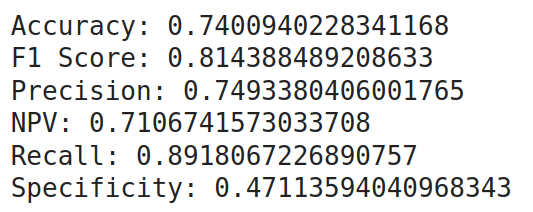
    </td>
    <td>
      
Neural Network Metrics

      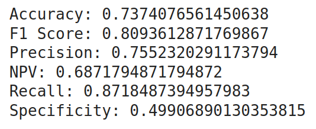
    </td>
  </tr>
  <tr>
    <td>
      
Decision Tree Metrics

      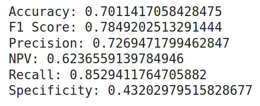
    </td>
    <td>
      
Random Forest Metrics

      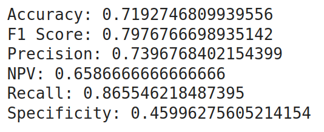
    </td>
  </tr>
</table>

#### Definition of Terms

- Accuracy: How likely is a choice that the model makes correct?
- F1 Score: Averages precision and recall scores.
- Precision: How likely is a positive choice that the model makes correct?
- NPV: How likely is a negative choice that the model makes incorrect?
- Recall: The ratio between the models positive choice and all true positive choices.
- Specificity: The ratio between the models negative choice and all true negative choices.

#### Metrics Analysis

Given the 6 metrics tested, the accuracy is usually the most usefull one and the most important one. However two other important metrics are precision and recall. Given these two metrics we can tell how many fights we are potentially missing out on in terms of betting (recall), and if the model is correct, what is the confidence of the predicion (precision). Of which we see a clear trend in most metrics favoring the models in the following order.

**Logistic Regression > Neural Networks > Random Forest > Decision Trees**

### Model ROC Curves

<table align="center">
  <tr>
    <td>
      
Logistic Regression ROC Curve

      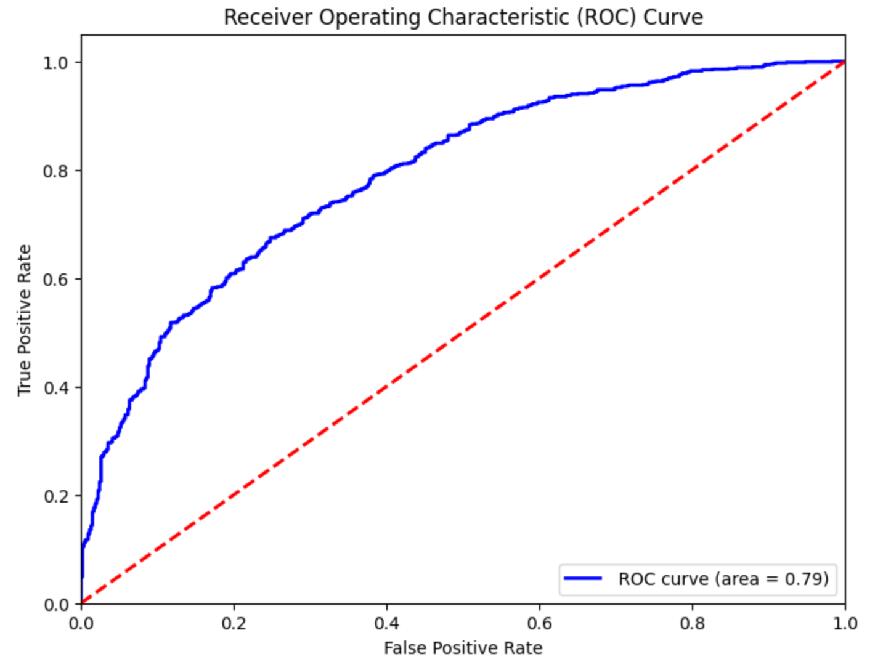
    </td>
    <td>
      
Neural Network ROC Curve

      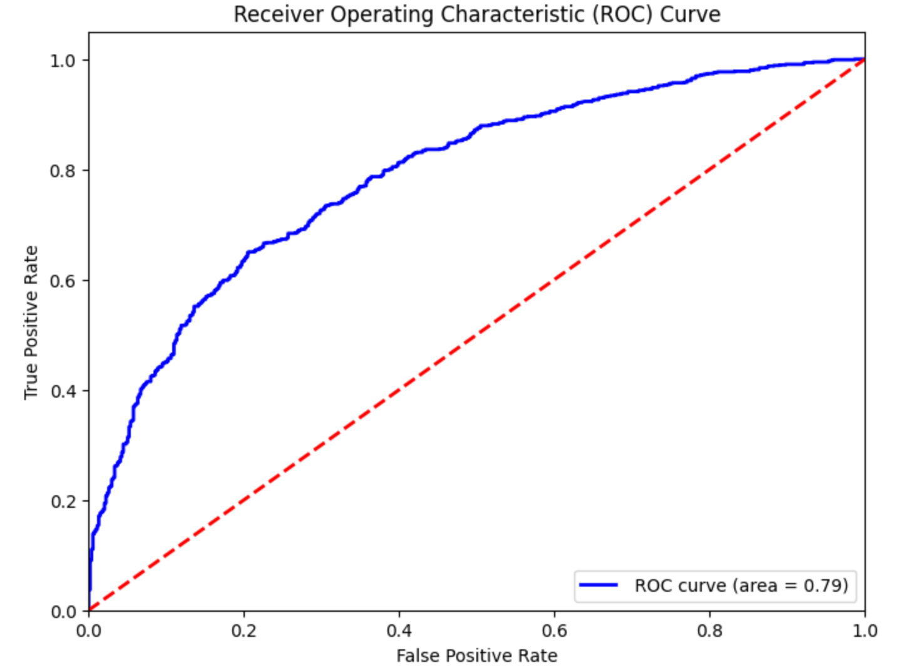
    </td>
  </tr>
  <tr>
    <td>
      
Decision Tree ROC Curve

      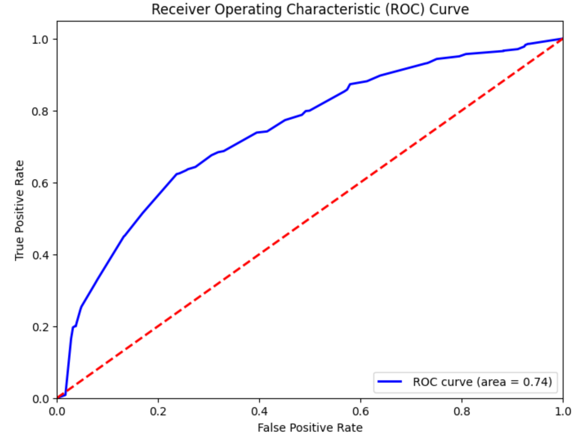
    </td>
    <td>
      
Random Forest ROC Curve

      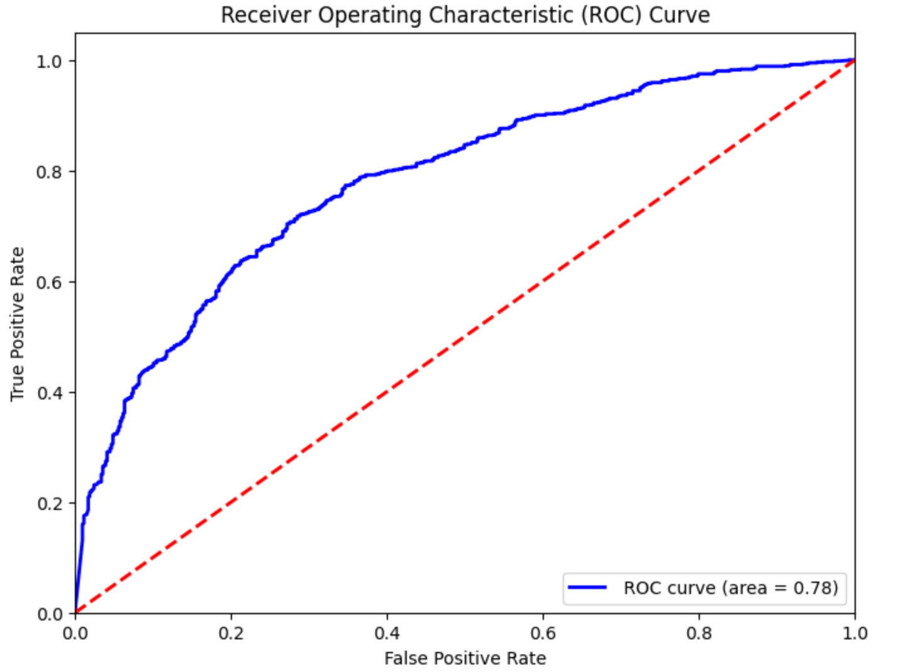
    </td>
  </tr>
</table>

#### ROC Analysis

An ROC Curve is a way to visualize binary classification problems. How this is done is by taking multiple thresholds and seeing how the outcomes of the models changes. This then forms curves of True Positives over False Positives maps out the relationship between the two. The AUC score is also displayed which shows the area under the curve so the higher the number, the better.

### Model Confusion Matrices

<table align="center">
  <tr>
    <td>
      
Logistic Regression Confusion Matrix

      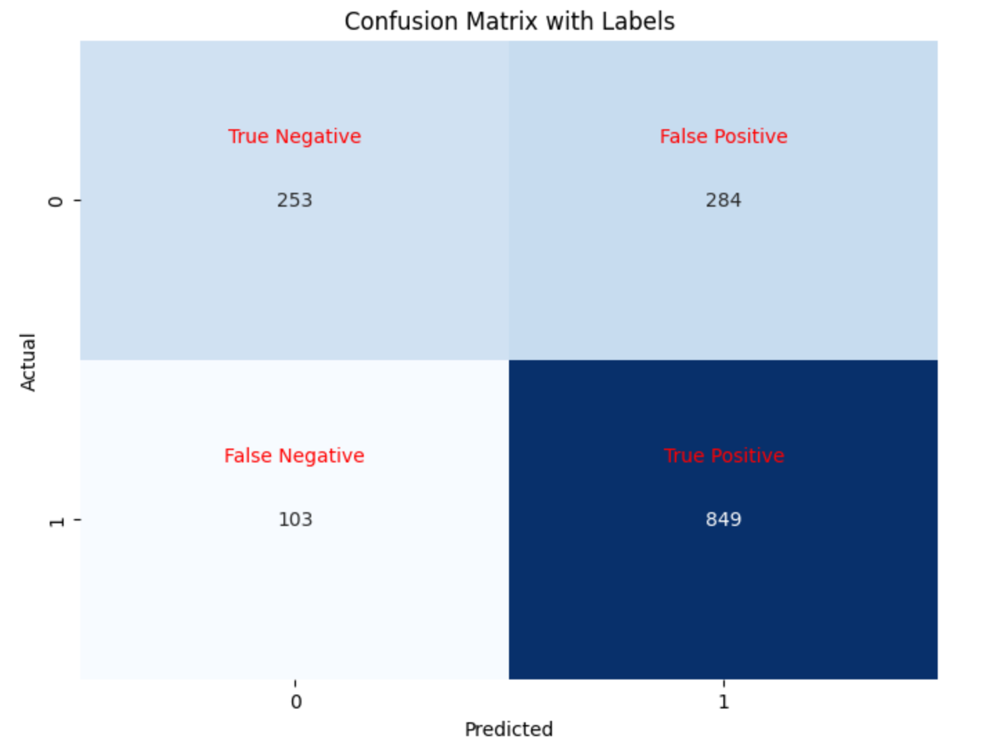
    </td>
    <td>
      
Neural Network Confusion Matrix

      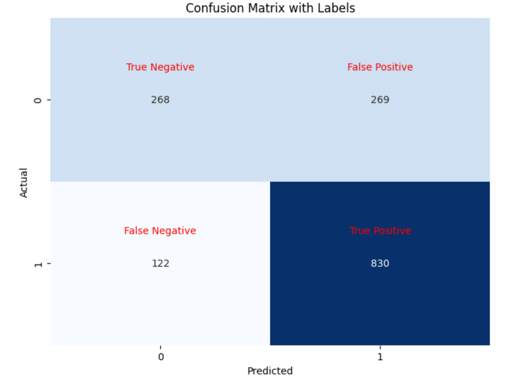
    </td>
  </tr>
  <tr>
    <td>
      
Decision Tree Confusion Matrix

      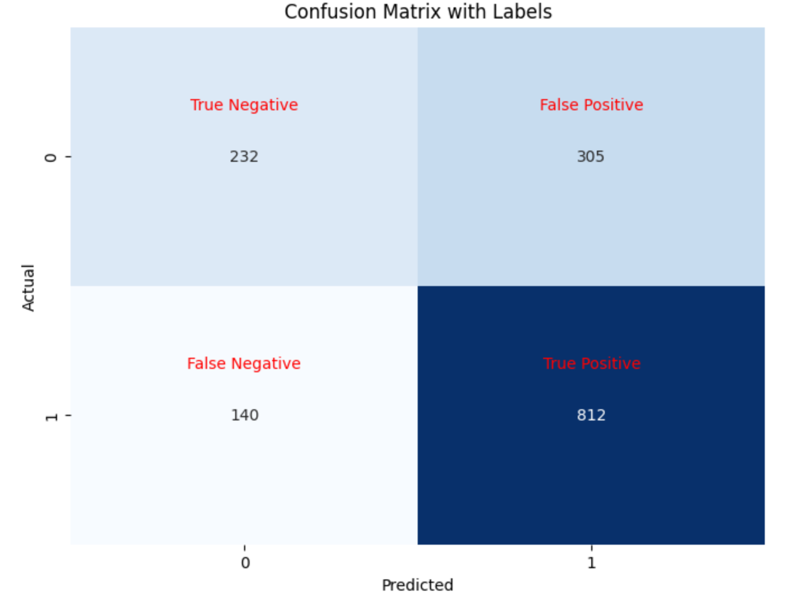
    </td>
    <td>
      
Random Forest Confusion Matrix

      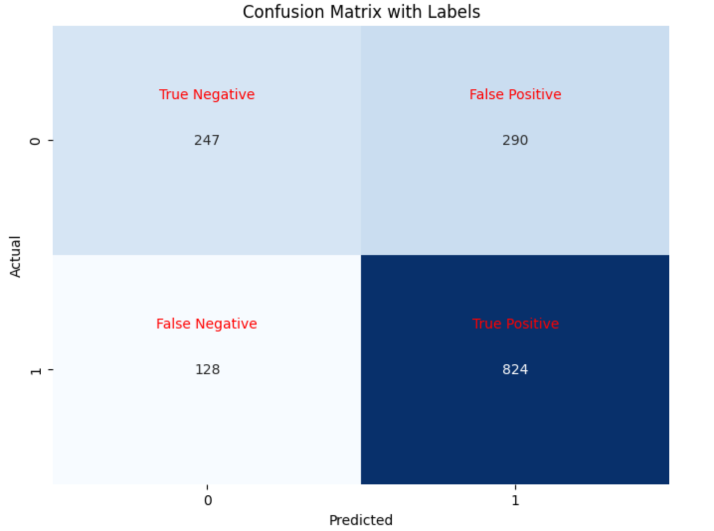
    </td>
  </tr>
</table>

#### Definition of Terms

- True Positives: Model predicts true and the result is correct.
- False Positives: Model predicts true and the result is incorrect.
- True Negatives: Model predicts false and the result is correct.
- False Negatives: Model predicts false and the result is incorrect.

#### Confusion Matrix Analysis

A confusion matrix is a way to see all the tested data to see where the various predictions lie. With this you can see the number of true positives, false positives, true negatives, and false negatives. With this we can more accuratly see the distribution of all the metrics come into play here.
